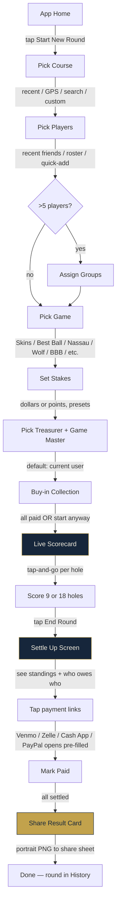
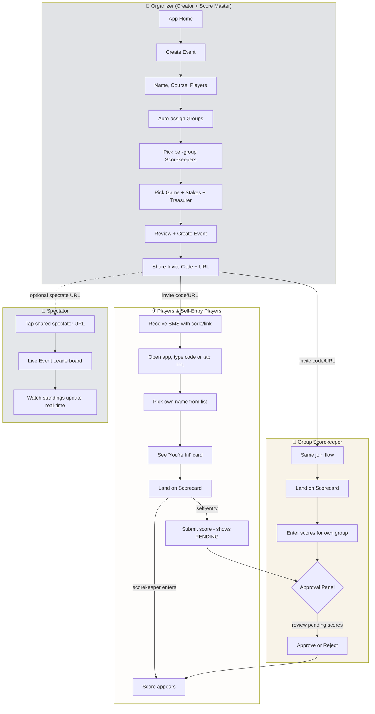
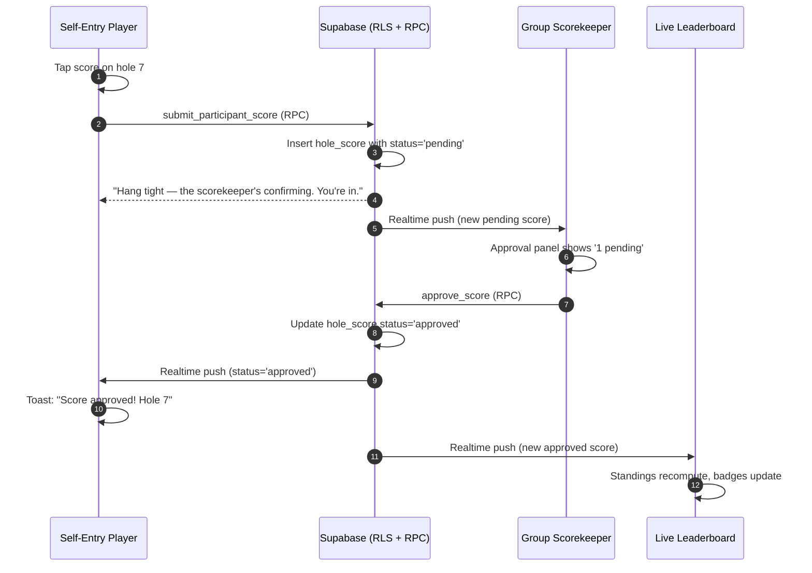
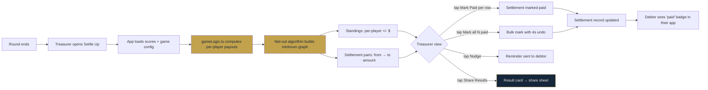
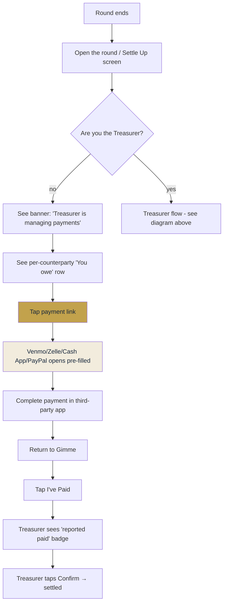
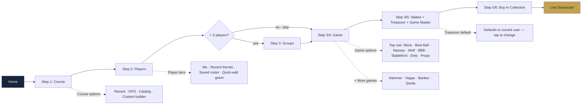
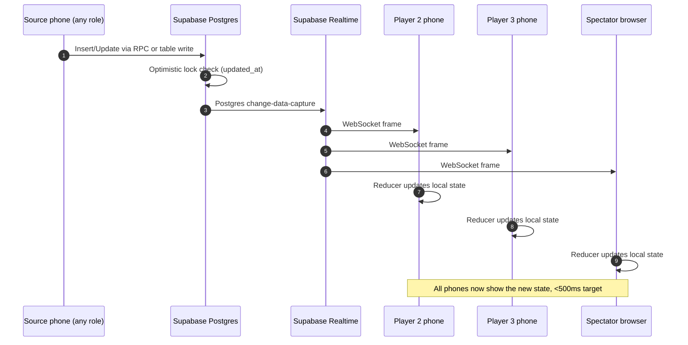
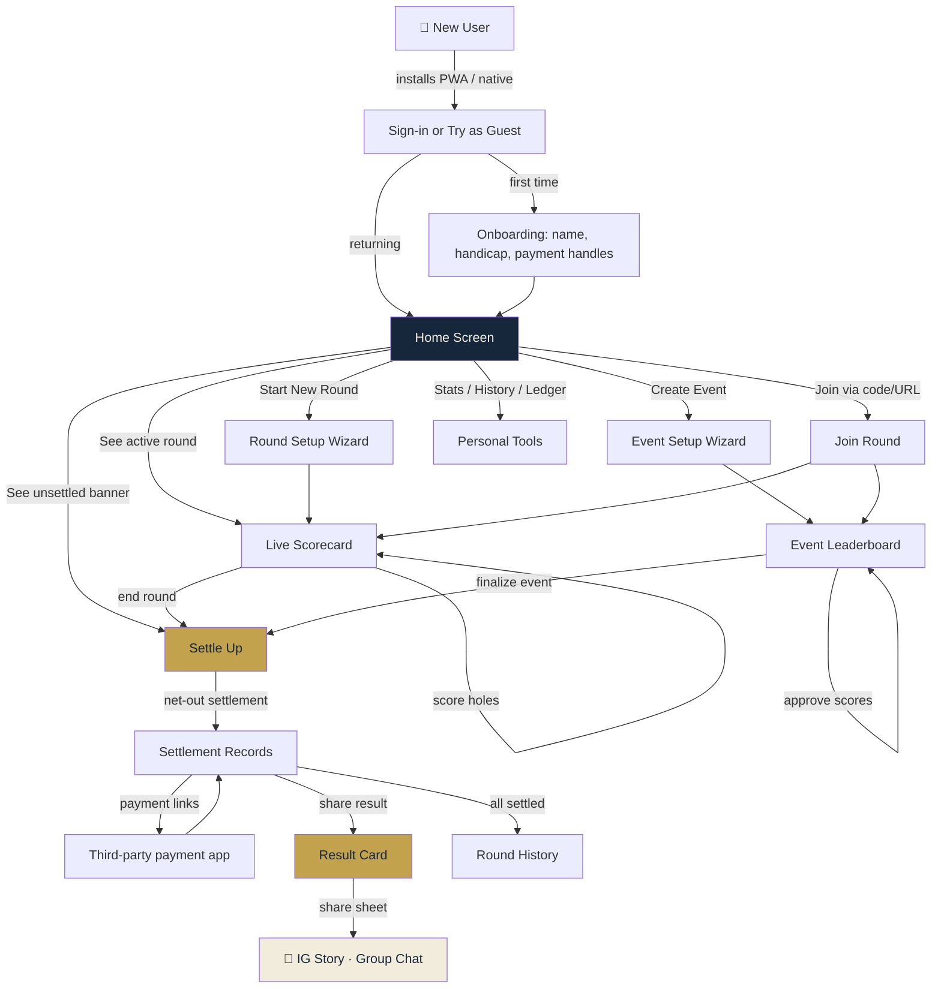

# Gimme — User Flows & Participant Roles

Visual reference for how a round moves through the product and which participant role does what at each step. Useful for product reviews, partner handoffs, persona walkthroughs, and onboarding new contributors.

> All diagrams render natively on GitHub and in the GitHub Pages preview. If you're reading this in another viewer, install a Mermaid plugin or paste into [mermaid.live](https://mermaid.live).

---

## 1. The roles

There are seven distinct participant roles. Most rounds collapse multiple roles onto one person; large events split them across the field.

| Role | Brand-team name | Who they are | What they uniquely do |
|---|---|---|---|
| **Round Creator** | (no public name) | The user who tapped "Start New Round" or "Create Event" | Owns the round record; can end the round; sees the round in their History |
| **Treasurer** | **Treasurer** | Holds the pot; routes settlement payments | Sees the Settle Up screen; Mark Paid; Nudge; bulk Mark All Paid |
| **Game Master** | **Game Master** | Runs the games — sets carryovers, presses, junk values mid-round | Modifies in-round game config; resolves prop bets |
| **Group Scorekeeper** | Group Scorekeeper | One per group in events — official scorer for their foursome | Enters scores for their group; approves self-entered scores |
| **Score Master** | Score Master | Event-wide override — usually the event organizer | Overrides any score in any group; sees full event leaderboard |
| **Player** | Player | Plays, has scores entered for them | Sees their own scores, the leaderboard, the settle-up result |
| **Self-Entry Player** | Player | Plays AND enters their own scores | Submits scores; sees "Pending" until the group scorekeeper approves |
| **Spectator** | Spectator | Non-player, read-only audience | Watches the live leaderboard via a shared URL — no signup required |

**Common collapsings:**
- **Casual 4-some:** Creator = Treasurer = Game Master = Score Master = one person; the other 3 are Players.
- **Event with self-scoring:** Organizer = Creator = Score Master; each group has its own Scorekeeper; everyone else is a Player or Self-Entry Player.

---

## 2. The casual round flow (the most common case)

A 3–8 player round where one person does everything — sets up, scores, settles. Roles collapsed onto the Creator.

**Time targets** (per the brand brief, "under 60 seconds from open to first hole"):
- Home → first hole: ≤60 seconds
- Round end → first settlement link tapped: ≤30 seconds
- Result card render + share: ≤10 seconds

---

## 3. The event flow (multi-group outing, 12-32 players)

An organized event with self-scoring per group. Now we have parallel swim lanes — different participants are doing different things at the same time.

**Key interactions across roles:**
- Self-Entry Players' scores → PENDING → Group Scorekeeper approves → appears in leaderboard
- Score Master (Organizer) can override any approved score from any group
- Treasurer (designated during event setup) sees the Settle Up screen after the event completes

---

## 4. Scoring + approval — sequence detail

The most subtle interaction in the product. When a Self-Entry Player submits a score, it routes through approval before it counts.

**Where Score Master fits in:** the Score Master can bypass step 5 by directly editing any score, and the same realtime fan-out delivers the change to the affected Self-Entry Player and all Spectators within ~500ms.

---

## 5. Settle Up — settlement graph computation

After the round ends, the Treasurer opens Settle Up. The app computes the net-out graph (minimum number of payments) and renders it.

**Why the net-out matters:** without it, a 4-player round can produce up to 6 payment relationships (everyone pays everyone). The minimum-graph algorithm collapses these to N-1 settlements maximum, which is why the post-round 19th-hole math gets cleaner.

---

## 6. Settlement: from the debtor's perspective

If you're the player who owes money — not the Treasurer — your flow looks different.

---

## 7. Round creation wizard — the 5 steps

Detail on the casual round setup (Journey 3 in the ease-of-use assessment).

---

## 8. Role × capability matrix

Who can do what at any point in the round lifecycle.

| Action | Creator | Treasurer | Game Master | Group Scorekeeper | Score Master | Player | Self-Entry Player | Spectator |
|---|:---:|:---:|:---:|:---:|:---:|:---:|:---:|:---:|
| Start a new round / event | ✅ | — | — | — | — | — | — | — |
| End the round | ✅ | — | — | — | ✅ | — | — | — |
| Invite players (share code/URL) | ✅ | — | — | ✅ | ✅ | — | — | — |
| Add players mid-round | ✅ | — | — | — | ✅ | — | — | — |
| Enter scores for own group | ✅ | — | — | ✅ | ✅ | — | — | — |
| Enter scores for any group | ✅ | — | — | — | ✅ | — | — | — |
| Submit own score | — | — | — | — | — | — | ✅ | — |
| Approve / reject self-entered scores | — | — | — | ✅ | ✅ | — | — | — |
| Override any score | — | — | — | — | ✅ | — | — | — |
| Create prop bet mid-round | ✅ | — | ✅ | — | ✅ | — | — | — |
| Resolve prop bet | — | — | ✅ | — | ✅ | — | — | — |
| Configure junk/dots values | ✅ | — | ✅ | — | ✅ | — | — | — |
| Modify carryover/press settings mid-round | — | — | ✅ | — | ✅ | — | — | — |
| View Settle Up screen | ✅ | ✅ | — | — | ✅ | ✅* | ✅* | — |
| Mark settlements paid | — | ✅ | — | — | — | — | — | — |
| Bulk Mark All Paid | — | ✅ | — | — | — | — | — | — |
| Send Nudge | — | ✅ | — | — | — | — | — | — |
| Mark "I've paid" (debtor side) | — | — | — | — | — | ✅ | ✅ | — |
| Share Result Card | ✅ | ✅ | ✅ | ✅ | ✅ | ✅ | ✅ | ✅ |
| View Live Leaderboard | ✅ | ✅ | ✅ | ✅ | ✅ | ✅ | ✅ | ✅ |

\* Players and Self-Entry Players see Settle Up filtered to their own counterparties only — not the full graph.

---

## 9. Where each surface lives (engineering handoff)

For partners porting to native, map each flow to its source-of-truth web component.

| Role / Flow | Primary component | Supporting libs |
|---|---|---|
| Sign-in / guest | `src/components/Auth/Auth.tsx` | `lib/supabase.ts` (auth) |
| Onboarding | `src/components/Onboarding/Onboarding.tsx` | — |
| Home screen | `src/App.tsx` (the `Home` component) | — |
| Casual round setup | `src/components/NewRound/NewRound.tsx` (~2,400 lines, 5 steps) | `lib/gameLogic.ts`, `lib/money.ts` |
| Event setup | `src/components/EventSetup/EventSetup.tsx` | `lib/eventUtils.ts` |
| Join a round | `src/components/JoinRound/JoinRound.tsx` | `lib/inviteCode.ts` |
| Scoring (all roles) | `src/components/Scorecard/Scorecard.tsx` (~2,000 lines) | `lib/gameLogic.ts`, `lib/realtimeReducers.ts`, `lib/safeWrite.ts` |
| Approval panel (Scorekeeper, Score Master) | Inside `Scorecard.tsx` | `lib/permissions.ts` |
| Prop bets | `src/components/PropBets/*` + `Scorecard/HoleBetsPanel.tsx` | `lib/propTemplates.ts` |
| Live event leaderboard | `src/components/EventLeaderboard/EventLeaderboard.tsx` | Supabase Realtime |
| Spectator | Same as event leaderboard, with `?spectate=CODE` URL param | — |
| Settle Up (Treasurer) | `src/components/SettleUp/SettleUp.tsx` (~1,800 lines) | `lib/gameLogic.ts` (net-out algo) |
| Settle Up (Player/Self-Entry Player) | Same component, filtered to own counterparties | `lib/permissions.ts` |
| Result Card share | `src/components/ShareCard/ShareCard.tsx` + `useShareImage.ts` | html2canvas (web) → native canvas (native) |
| Round History | `src/components/RoundHistory/RoundHistory.tsx` | — |
| Cross-round Ledger | `src/components/Ledger/Ledger.tsx` | — |
| Personal Dashboard | `src/components/PersonalDashboard/PersonalDashboard.tsx` | — |

---

## 10. Real-time fan-out

How a single tap by one role propagates to everyone else in <500ms.

The reducer pattern (`src/lib/realtimeReducers.ts`) ensures that all subscribed clients converge to the same state from the same change stream, regardless of order of arrival.

---

## 11. The full lifecycle, one diagram

How everything connects, top to bottom.

---

## 12. For the persona-curious

This doc maps tightly to the personas in `src/FLOW-TESTING-PLAN.md`:

| Persona | Primary role | Primary flow | Pain point |
|---|---|---|---|
| **Dave** | Organizer (Creator + Score Master) | Event flow §3 | Treasurer placement was buried (fixed); no edit-in-place on review (open) |
| **Jess** | Brand-new Self-Entry Player | Onboarding §2 → Casual round §2 | Handicap field jargon (fixed: hint added) |
| **Rick** | Group Scorekeeper | Scoring + approval §4 | No undo on score entry (fixed: 4s toast) |
| **Maya** | Self-Entry Player | Join Round + scoring | PENDING badge unexplained (already had a tap-to-explain popover) |
| **Connor** | Player + Game Master | Mid-round prop bets | Non-hole bets unsupported (open) |
| **Tomoko** | Spectator + golf newbie | Spectator §3 | Terminology unexplained (open) |
| **Pat** | Treasurer of 20-player event | Settle Up §5 | No bulk Mark All Paid (fixed) |
| **Stan** | Returning Player after months away | Auth recovery | Guest history not auto-linked (open) |

---

_Last updated when shipped. Keep this doc current as flows evolve — it's the single source of truth for "what does the user actually do" across roles._
